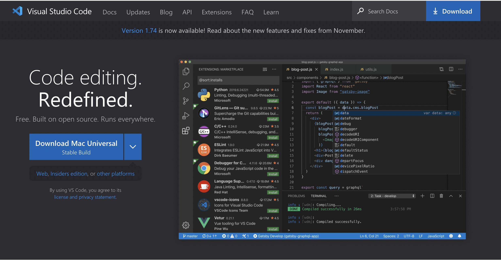
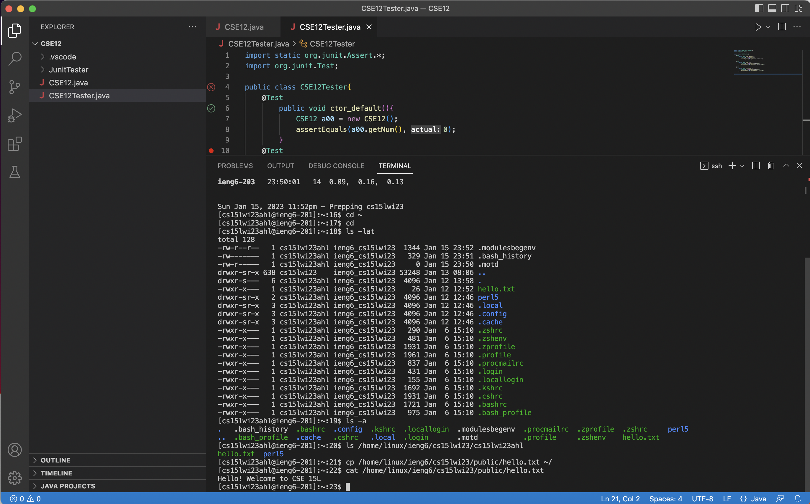

# WEEK 1 Lab Report
## 1. Installing VScode
1. Click the link: [How to download Vscode](https://code.visualstudio.com/). The image of the link will be like that.

2. Follow the steps of that website, find the suitable version for your computer, and download the VS code.

3. Open the VScode, and go to the terminal at the bottom. That is the place we need to put our commands.

## 2. Remotely Connecting 

## 3. Trying Some Commands

