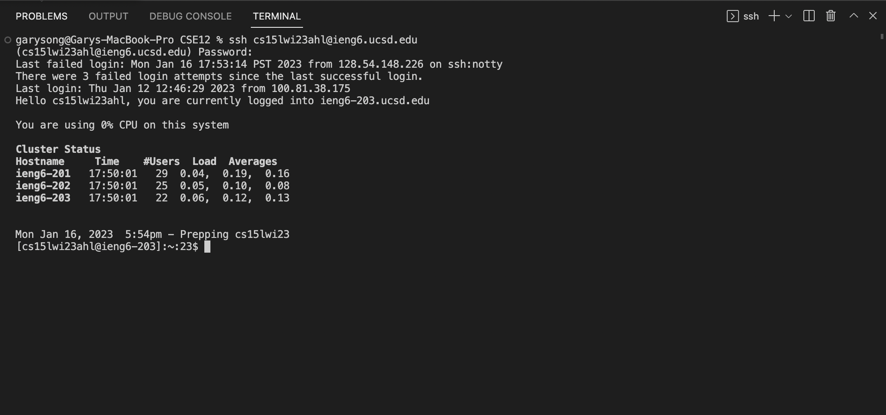
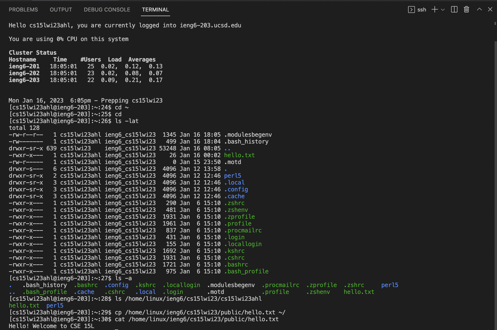

# WEEK 1 Lab Report
## 1. Installing VScode
1. Click the link: [How to Download Vscode](https://code.visualstudio.com/). The image of the link will be like that.

2. Follow the steps of that website, find the suitable version for your computer, and download the VS code.

3. Open the VScode, and go to the terminal at the bottom. That is the place we need to put our commands.

## 2. Remotely Connecting
1. Look up your course-specific account for CSE15L here: [Your Specific Account](https://sdacs.ucsd.edu/~icc/index.php).
2. You need to follow the instructions and reset the password. Here is a tutorial: [How to Reset Your Password](https://docs.google.com/document/d/1hs7CyQeh-MdUfM9uv99i8tqfneos6Y8bDU0uhn1wqho/edit).
3. You need to open the terminal in VScode and use `ssh` to connect remotely. Your command should be like `ssh cs15lwi23zz@ieng6.ucsd.edu` and `zz` should be replaced by the letters in your course-specific account.
4. After inputing your password, if your successfully log in, your terminal will be like the following page.

## 3. Trying Some Commands
After you success in remotely connecting, you can try some commands in your terminal. There are some following commands that you can put in the terminal.

* `cd ~`
* `cd`
* `ls -lat`
* `ls -a`
* `ls <directory>` where `<directory>` is `/home/linux/ieng6/cs15lwi23/cs15lwi23abc`, where the `abc` is the letters in your course-specific account
* `cp /home/linux/ieng6/cs15lwi23/public/hello.txt ~/`
* `cat /home/linux/ieng6/cs15lwi23/public/hello.txt`

